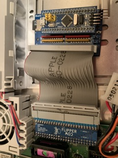
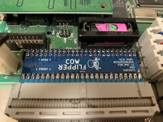
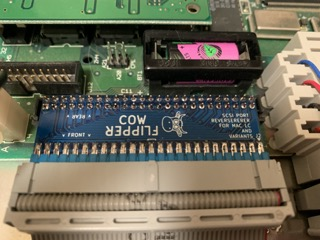
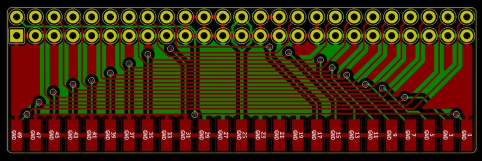

# Cow-Flipper

An adapter to flip the Macintosh LC internal SCSI port by 180-degrees so devices like the original BlueSCSI can be plugged in with the OEM cable.

## Get One

*Link TBA*

## Make One

The Gerber files you can use to fabricate your own boards can be found in the [gerber](gerber/) directory.

## Image Credit

The "cow head" image is based on "[Oh la vache!](https://openclipart.org/detail/306907/oh-la-vache)" by "j4p4n", from openclipart.org/

## License

Board design distributed under the terms of the [Creative Commons
Attribution-NonCommercial-ShareAlike 4.0 International (CC BY-NC-SA 4.0) License](https://creativecommons.org/licenses/by-nc-sa/4.0/).

